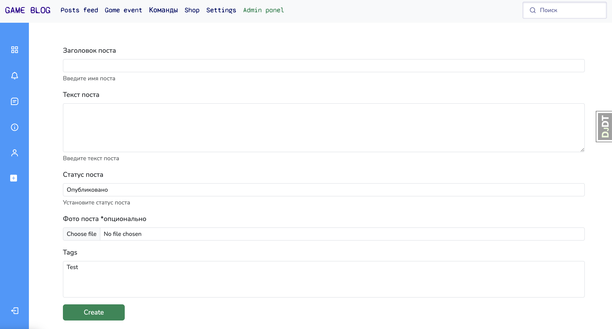

# Игровая социальная сеть


Добро пожаловать в проект "Игровая социальная сеть"! Этот проект представляет собой платформу для геймеров, которая включает в себя разнообразные функциональные возможности, такие как корзина покупок, чаты, публикации, игровые команды и многое другое.

## Содержание

- [Описание проекта](#описание-проекта)
- [Структура проекта](#структура-проекта)
- [Установка](#установка)
- [Использование](#использование)

## Описание проекта

Проект "Игровая социальная сеть" предназначен для создания сообщества геймеров, предоставляя различные функции для взаимодействия, обмена контентом и покупок. В проекте предусмотрены такие возможности, как публикации статей и новостей, создание игровых команд, управление корзиной покупок, взаимодействие с платежными системами и многое другое.

## Структура проекта

Проект состоит из следующих приложений:

- **actions**: Сохранение последних действий пользователя на сайте.
- **api**: Частичное API для каждого из приложений (в разработке).
- **cart**: Корзина для покупок.
- **chats**: Чаты пользователей (в разработке).
- **coupons**: Купоны для покупок в магазине.
- **events**: Игровые события (запланировано в будущем).
- **gameblog**: Главное приложение, содержит главную страницу и функционал, переиспользуемый другими приложениями.
- **gameteams**: Игровые команды.
- **orders**: Заказы (покупка продуктов в приложении).
- **payment**: Взаимодействие с платежной системой.
- **posts**: Публикации (посты, новости, статьи).
- **users**: Профиль пользователя, авторизация, регистрация, 
    взаимодействия пользователей (подписки, друзья ...).

### Стек технологий

- Python 3.12
- Django 5.0
- DjangoRestFramework
- Redis
- Celery
- Ajax
- JavaScript
- HTMX
- Docker
- TailWind CSS
- Postgresql

## Установка

### Шаги установки

1. Клонируйте репозиторий:

    ```bash
    git clone https://github.com/AlexeyTarasov77/GamingSocialNetwork.git
    cd service
    ```
2. Сборка проекта (Может занять несколько минут):

    ```bash
    docker compose build
    ```

3. Запуск проекта:

    ```bash
    docker compose up
    ```

## Использование

### Запуск сервера разработки

После установки если проект уже собран, запустите через:

```bash
docker compose up
```

# Основные возможности

## Команды пользователей

Пользователи могут создавать и присоединяться к командам для совместного взаимодействия и участия в различных мероприятиях. Команды могут иметь свои собственные страницы с новостями, событиями и обсуждениями.


## Обмен контентом

Пользователи могут обмениваться различным контентом, таким как посты, статьи и новости. Эта функциональность позволяет делиться важной информацией, обсуждать новости и писать статьи на интересующие темы.




## Чаты между пользователями

Для удобного общения предусмотрены чаты между пользователями. Это могут быть как приватные переписки, так и групповые чаты, где можно обсуждать различные темы и обмениваться сообщениями в реальном времени.


## Онлайн магазин игр

В нашем проекте есть онлайн-магазин, где пользователи могут покупать игры. Магазин предлагает широкий ассортимент игр, скидки и специальные предложения.


## Взаимодействия между пользователями

Пользователи могут взаимодействовать друг с другом различными способами:
- **Подписки**: Подписывайтесь на интересных пользователей, чтобы получать обновления их контента.
- **Подписчики**: Следите за тем, кто подписан на вас.
- **Друзья**: Добавляйте друзей для более тесного общения и взаимодействия.


## Внесение вклада

Мы рады, что вы хотите внести свой вклад в наш проект! Пожалуйста, следуйте этим шагам, чтобы помочь улучшить Gaming Social Network:

1. **Форк репозитория**: Нажмите на кнопку "Fork" в правом верхнем углу этой страницы, чтобы создать копию репозитория в вашем аккаунте GitHub.

2. **Клонируйте форкнутый репозиторий** на ваш локальный компьютер:
    ```sh
    git clone https://github.com/AlexeyTarasov77/GamingSocialNetwork.git
    cd GamingSocialNetwork
    ```

3. **Создайте новую ветку** для ваших изменений:
    ```sh
    git checkout -b имя-вашей-ветки
    ```

4. **Внесите изменения** в коде или документации. Убедитесь, что вы протестировали свои изменения перед коммитом.

5. **Коммит ваших изменений**:
    ```sh
    git add .
    git commit -m "Описание ваших изменений"
    ```

6. **Отправьте изменения** в ваш форкнутый репозиторий:
    ```sh
    git push origin имя-вашей-ветки
    ```

7. **Создайте Pull Request**: Перейдите в оригинальный репозиторий и нажмите на кнопку "New Pull Request". Опишите ваши изменения и отправьте запрос на слияние.

Спасибо за ваш вклад! Ваши изменения помогут сделать наш проект лучше.


## Прогон тестов

1. Запустите проект пользуясь инструкциями в секции [Использование](#использование).

2. Войдите в оболочку терминала внутри контейнера с приложением.

```bash
docker exec -it sc-service sh
```

3. Для запуска тестов выполните команду:

```bash
python3 manage.py test
```
